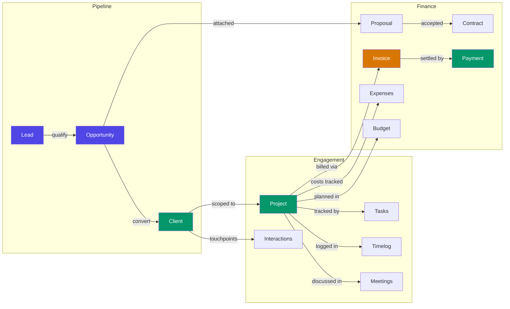

# Business Lifecycle

The full business lifecycle from lead capture to payment collection.
Each stage maps to a content collection.



## Stage Details

### 1. Lead Capture

A lead enters the system via referral, social, inbound, or cold outreach.

```
content/leads/{lead-slug}/index.md
status: new → contacted → qualified → disqualified
```

### 2. Opportunity Qualification

A qualified lead becomes an opportunity with a defined value, probability,
and expected close date.

```
content/opportunities/{slug}/index.md
stage: discovery → scoping → proposal-sent → negotiation → closed-won | closed-lost
```

### 3. Client Conversion

A closed-won opportunity converts to a client. The client becomes the parent
namespace for contacts, contracts, invoices, and interactions.

```
content/clients/{client-slug}/index.md
status: active | inactive | churned
```

### 4. Project Execution

Projects are scoped to clients. Tasks, meetings, timelog, and files are
namespaced under the project slug.

```
content/projects/{project-slug}/index.md
status: active → paused → completed → archived
```

### 5. Proposal & Contract

Proposals are versioned and linked to opportunities. Accepted proposals
lead to signed contracts.

```
content/proposals/{client-slug}/proposal-v1.md
content/contracts/{client-slug}/contract-v1.md
```

### 6. Invoicing & Payment

Invoices reference a project and client. Payments reference an invoice.

```
content/invoices/{client-slug}/inv-001.md
status: draft → sent → paid | overdue | cancelled

content/payments/{client-slug}/pay-001.md
status: pending → confirmed | failed
```

### 7. Financial Tracking

Expenses and budgets are tracked per project. Tax periods aggregate
across all financial data.

```
content/expenses/{project-slug}/expense-name.md
content/budgets/{project-slug}/index.md
content/tax/{year}/index.md
```
