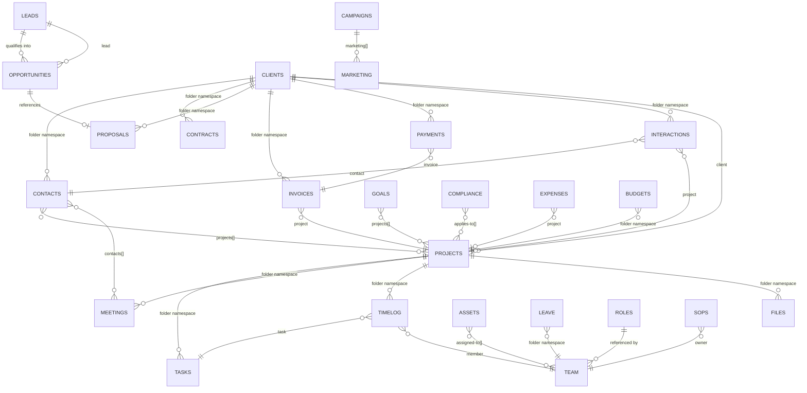

# Entity Relationships

Collection relationship diagram for my-buddy. Arrows show reference direction
(from → to). Folder-based relationships use the parent slug as the folder name.

## Namespace Strategy

Relationships are resolved in two ways:

1. **Folder namespace** — the subfolder name IS the foreign key
   - `tasks/test-project/setup.md` → belongs to project `test-project`
   - `contacts/acme-corp/john-doe.md` → belongs to client `acme-corp`

2. **Frontmatter reference** — a field contains the target slug
   - `invoices/acme-corp/inv-001.md` → `project: test-project`
   - `payments/acme-corp/pay-001.md` → `invoice: inv-001`

## Cardinality Reference

| From | Field | To | Cardinality |
|---|---|---|---|
| opportunities | lead | leads | Many-to-One |
| opportunities | proposal | proposals | One-to-One |
| projects | client | clients | Many-to-One |
| tasks | project (folder) | projects | Many-to-One |
| contacts | client (folder) | clients | Many-to-One |
| contacts | projects[] | projects | Many-to-Many |
| contracts | client (folder) | clients | Many-to-One |
| proposals | client (folder) | clients | Many-to-One |
| invoices | client (folder) | clients | Many-to-One |
| invoices | project | projects | Many-to-One |
| payments | invoice | invoices | Many-to-One |
| timelog | project (folder) | projects | Many-to-One |
| timelog | task | tasks | Many-to-One |
| timelog | member | team | Many-to-One |
| meetings | project (folder) | projects | Many-to-One |
| meetings | contacts[] | contacts | Many-to-Many |
| interactions | client (folder) | clients | Many-to-One |
| interactions | contact | contacts | Many-to-One |
| interactions | project | projects | Many-to-One |
| expenses | project (folder) | projects | Many-to-One |
| files | project/client (folder) | projects/clients | Many-to-One |
| campaigns | marketing[] | marketing | One-to-Many |
| goals | projects[] | projects | Many-to-Many |
| assets | assigned-to[] | team | Many-to-Many |
| leave | member (folder) | team | Many-to-One |
| sops | owner | team | Many-to-One |
| compliance | applies-to[] | projects | Many-to-Many |
| roles | (referenced by) | team.role | One-to-Many |

**Note:** Some relationships are intentionally one-directional. For example,
`contacts.projects[]` references projects, but `projects` has no `contacts[]`
field — contacts for a project are resolved at query time via filtering.
