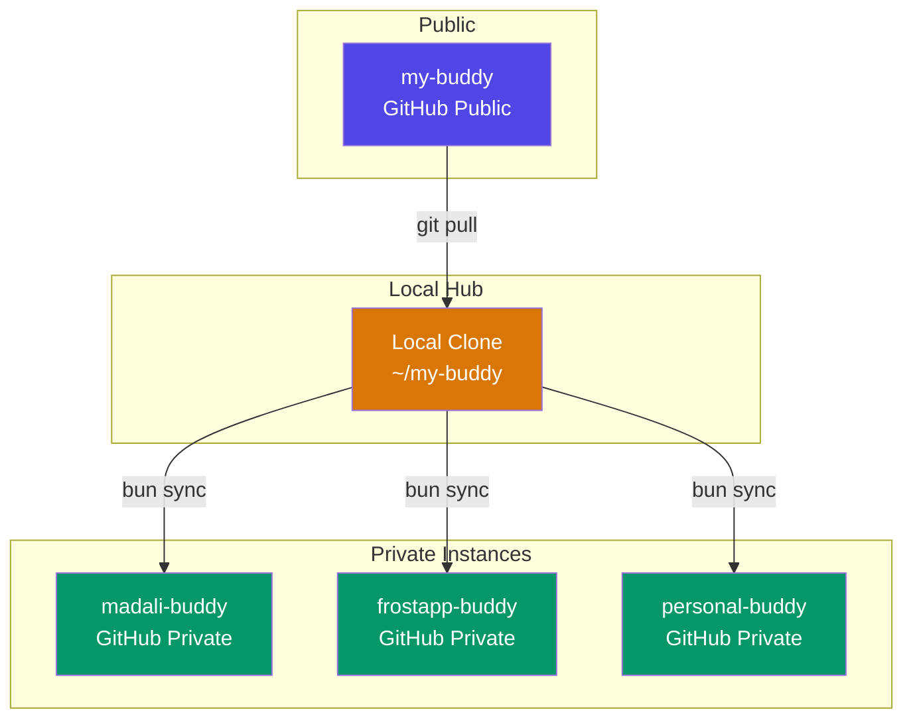

# Multi-Instance Architecture

my-buddy is open-source. The public repo contains app code only. Real
business data lives in private instance repos — one per business.



## Repository Roles

| Repo | Visibility | Contains | Issues/PRs |
|---|---|---|---|
| `my-buddy` | Public | App code + `content.example/` | Yes — all development |
| `madali-buddy` | Private | App code + real content | No — working instance |
| `frostapp-buddy` | Private | App code + real content | No — working instance |

## What Gets Synced

The sync script (`bun sync`) reads `buddy.instances.json` and rsyncs app
code to each registered instance.

| Synced (app code) | Not synced (instance-specific) |
|---|---|
| `src/` | `content/` |
| `scripts/` | `buddy.config.ts` |
| `.templates/` | `buddy.instances.json` |
| `.claude/commands/` | `.git/` |
| `docs/` | `node_modules/` |
| `astro.config.mjs` | |
| `package.json` | |
| `biome.jsonc` | |
| `tsconfig.json` | |

After sync, each instance runs `bun install` if `package.json` changed.

## Scaffolding a New Instance

```bash
bun create my-buddy
```

1. Copies app code from the public repo
2. Renames `content.example/` → `content/`
3. Initializes a new git repo
4. Prompts for instance name, accent color, and persona config
5. User links to their own private remote

```bash
cd ~/new-buddy
git remote add origin git@github.com:user/new-buddy.git
git push -u origin main
```

## Sync Workflow

```bash
# From the local hub (public repo clone)
cd ~/my-buddy
git pull                    # Fetch latest app updates
bun sync                    # Distribute to all instances
bun sync --dry-run          # Preview without writing
```

## Instance Management

```bash
bun instances                           # List all instances
bun instances:add madali-buddy ~/madali-buddy   # Register
bun instances:remove madali-buddy               # Unregister
```

Registry file (`buddy.instances.json`):

```json
{
  "instances": [
    { "name": "madali-buddy", "path": "~/madali-buddy" },
    { "name": "frostapp-buddy", "path": "~/frostapp-buddy" }
  ]
}
```

## Content Backup

Each instance IS a private Git repo. Content backup is `git push`.
No separate backup script needed — the instance's git history is the backup.

```bash
# From within an instance
git add content/
git commit -m "daily content snapshot"
git push
```

The `/mybuddy.backup` command automates this: stage content, commit, push.
