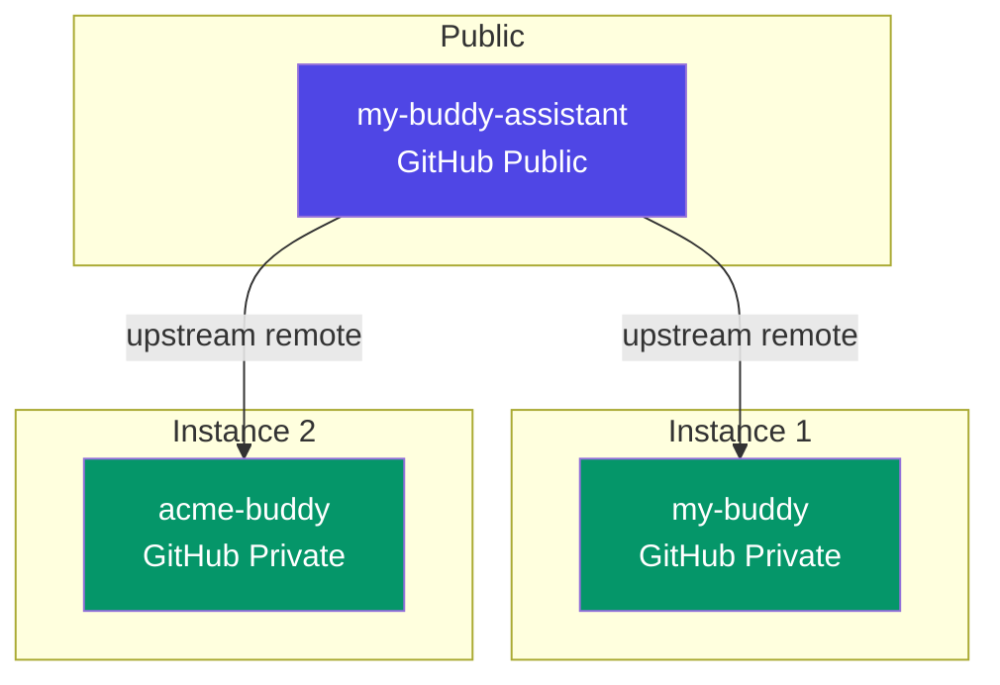

# Multi-Instance Architecture

my-buddy-assistant is the open-source template repo. Each business gets its
own private instance with an `upstream` remote pointing back to the template
for updates.



## Repository Roles

| Repo | Visibility | Contains | Purpose |
|---|---|---|---|
| `my-buddy-assistant` | Public | App code + `content.example/` | Template — all development happens here |
| User's instance | Private | App code + real `content/` | Working instance — business data lives here |

## Installing a New Instance

```bash
curl -fsSL https://raw.githubusercontent.com/mayknxyz/my-buddy-assistant/main/install.sh | bash
```

The install script:

1. Clones the template repo (shallow)
2. Strips git history — fresh `git init`
3. Sets `upstream` remote to `my-buddy-assistant`
4. Copies `content.example/` → `content/`
5. Copies `buddy.config.example.ts` → `buddy.config.ts`
6. Applies `CLAUDE.instance.md` as `CLAUDE.md`
7. Creates empty `CLAUDE.local.md` for custom AI instructions
8. Runs `bun install`
9. Creates initial commit
10. Optionally creates a private GitHub repo via `gh`

## Syncing Updates

```bash
bun run sync
```

The sync script (`scripts/sync.sh`):

1. Guards against dirty working tree (aborts if uncommitted changes)
2. Fetches from `upstream`
3. Shows incoming commits
4. Merges `upstream/main`
5. Auto-applies `CLAUDE.instance.md` as `CLAUDE.md` if it changed
6. Auto-runs `bun install` if `package.json` changed

### Handling Merge Conflicts

If a merge conflict occurs, resolve it with standard Git tools:

```bash
# Fix conflicts manually, then:
git add .
git commit

# Escape hatch — accept all upstream app code:
git checkout upstream/main -- src/
git add . && git commit
```

## What Gets Synced

| Synced (app code) | Not synced (instance-specific) |
|---|---|
| `src/` | `content/` |
| `scripts/` | `buddy.config.ts` |
| `.templates/` | `CLAUDE.local.md` |
| `.claude/commands/` | `.git/` |
| `docs/` | `node_modules/` |
| `astro.config.mjs` | |
| `package.json` | |
| `biome.jsonc` | |
| `tsconfig.json` | |
| `CLAUDE.instance.md` | |

## AI Guardrails

Instance `CLAUDE.md` (applied from `CLAUDE.instance.md`) restricts AI to:

- `content/` — business data
- `buddy.config.ts` — instance configuration
- `CLAUDE.local.md` — custom AI instructions

This prevents accidental edits to app code that would cause merge conflicts
on the next sync.

## Content Backup

Each instance IS a private Git repo. Content backup is `git push`.

```bash
git add content/
git commit -m "daily content snapshot"
git push
```
